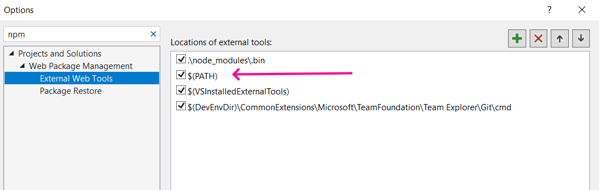

# YouFind

> Autocompleting Fake Names since 2020!

_All persons represented in this app are fictional. Any relation to any person, living or dead, is purely coincidental._

## Features

ASP.NET Core web application, leveraging [ASP.NET Core SpaServices](https://docs.microsoft.com/en-us/aspnet/core/client-side/spa-services?view=aspnetcore-2.1) to host an Angular 9 front-end.

The server software comes pre-built with a random network latency simulator, pausing around 20% of incoming API requests for 3 seconds.

The server runs on a local SQL Server file (included in `APP_DATA`)

A few files have been renamed to enable a seemless first-start experience. Read [Getting Started - Developer]() for directions on how to set your workstation up for development or recompilation of the frontend.

## Getting Started - Reviewer

You will need:

- Visual Studio, preferably 2019

The easiest way to run the app is to simply compile through Visual Studio and run via IIS Express. Visual Studio should restore NuGet packages and launch your default browser. If no browser displays, you can navigate to [http://localhost:54344](http://localhost:54344) to begin your journey.

## Getting Started - Developer

You will need:

- Visual Studio, preferably 2019
- NodeJS version 10 or greater, and in your `%PATH%`

To use your system Node version instead of the built-in Visual Studio version, you must
adjust your `External Web Tools` settings like so:



`$(Path)` must be above `$(VsInstalledExtraTools)`, and Node 10 must already be available in your `PATH`

Next, to enable the Angular Live Development server, open `startup.cs` and set

```csharp
private bool USE_SPA_DEVELOPMENT_MODE = true;
```

Finally, re-enable the `package.json` files

```shell
cd YouFind\ClientApp
mv package.json.dev package.json
mv package-lock.json.dev package-lock.json
```

Compiling in Visual Studio will then restore `npm` packages, and also broker the Angular CLI build, resulting in a live development environment for the front-end.

### Shout-outs

[Fake Person Generator](https://www.fakepersongenerator.com/user-face-generator) for the profile pics
